<div align="center">

# dannyjoo-tistory-skin

**개인 티스토리 블로그를 위한 커스텀 스킨**


[](https://dannyjoo.tistory.com)
[](LICENSE)

</div>

<br>

## 스킨 고르기

<table>
  <tr>
    <th align="center" width="50%">Glass</th>
    <th align="center" width="50%">Grain</th>
  </tr>
  <tr>
    <td><a href="glass/">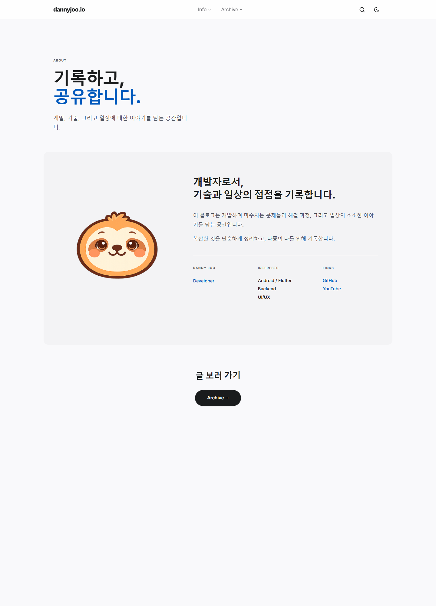</a></td>
    <td><a href="grain/">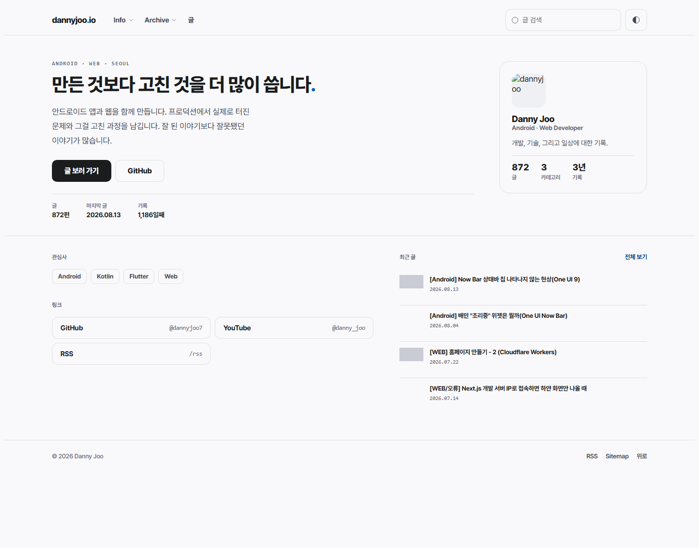</a></td>
  </tr>
  <tr>
    <td align="center"><strong><a href="glass/">glass/</a></strong></td>
    <td align="center"><strong><a href="grain/">grain/</a></strong></td>
  </tr>
</table>

| | Glass | Grain |
|:---|:---|:---|
| **인상** | 카드와 유리, 그림자 | 선과 여백, 그림자 없음 |
| **강조색** | 무채색 + 포인트 | 블루 `#0058bc` |
| **서체** | Inter | Pretendard |
| **모서리** | 둥근 카드 | 라운디드 스퀘어 |
| **목록** | 히어로 카드 + 그리드 | 첫 글 크게 + 그리드 |
| **사이드바** | 프로필 · 목차 · 아카이브 · 최근 글 | 카테고리 트리 · 목차 (본문 오른쪽) |
| **문서 크기** | 목록 339KB | 목록 55KB |

---

## 미리보기

### Glass

<table>
  <tr>
    <th align="center" width="50%">라이트</th>
    <th align="center" width="50%">다크</th>
  </tr>
  <tr>
    <td>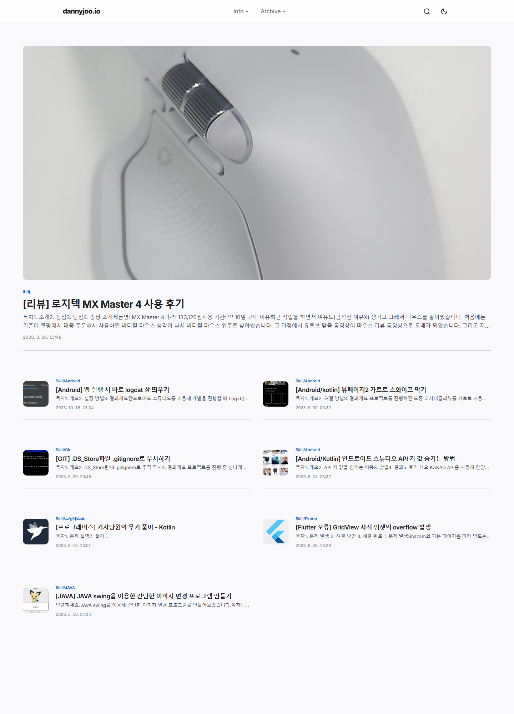</td>
    <td>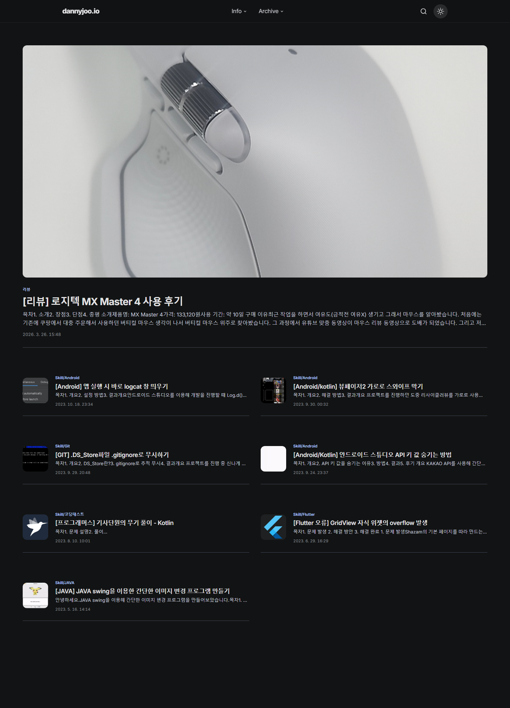</td>
  </tr>
  <tr>
    <td>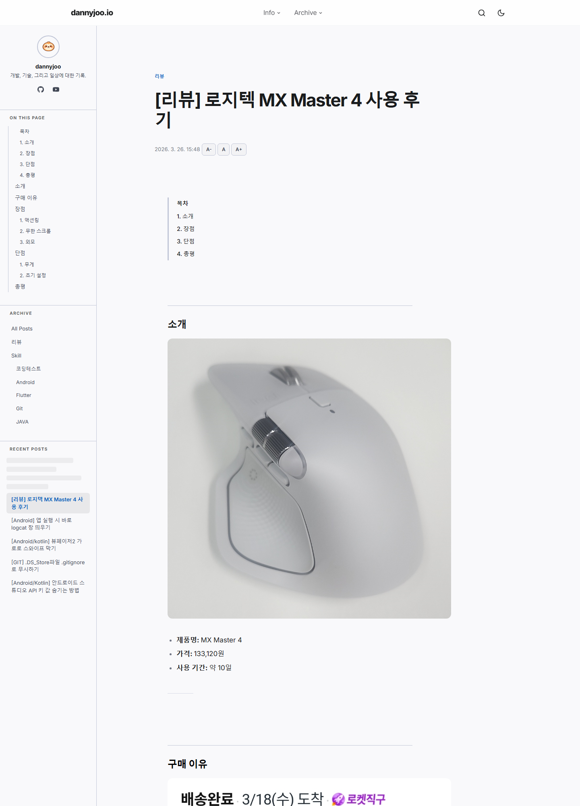</td>
    <td>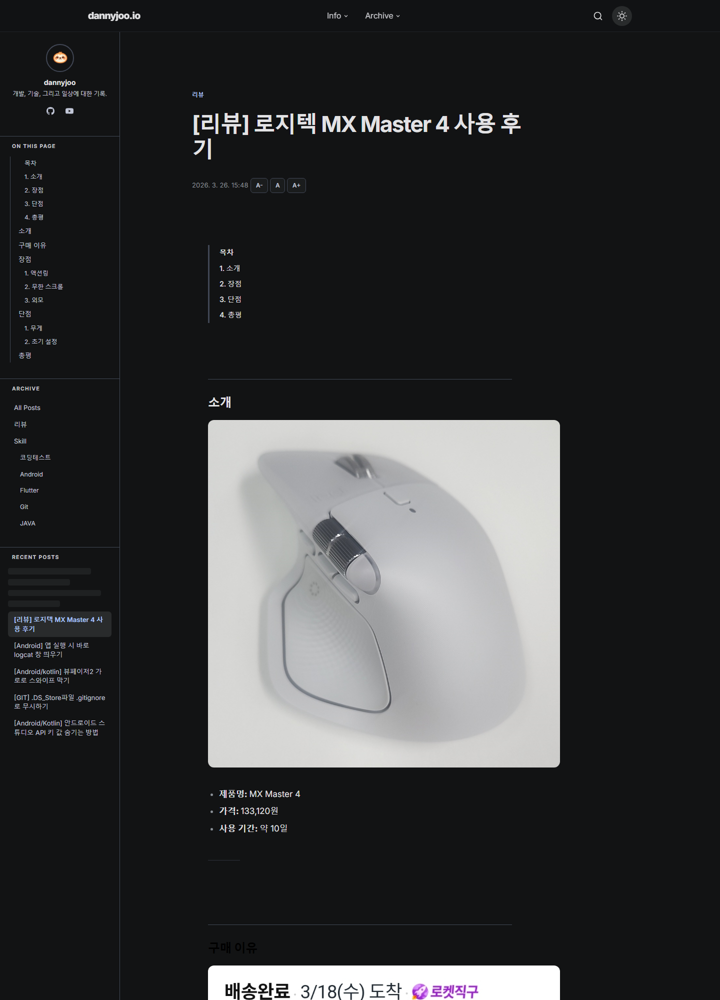</td>
  </tr>
</table>

<details>
<summary><strong>모바일</strong></summary>
<br>
<table>
  <tr>
    <th align="center" width="50%">글 목록</th>
    <th align="center" width="50%">글 상세</th>
  </tr>
  <tr>
    <td align="center">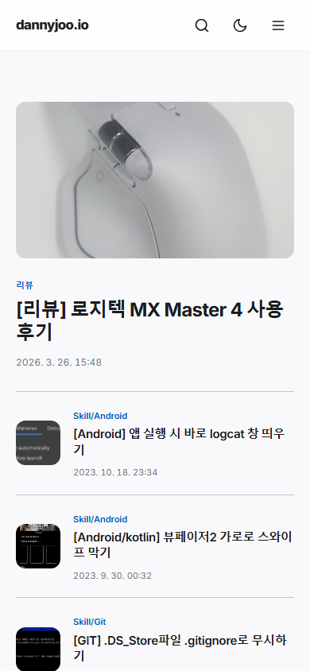</td>
    <td align="center">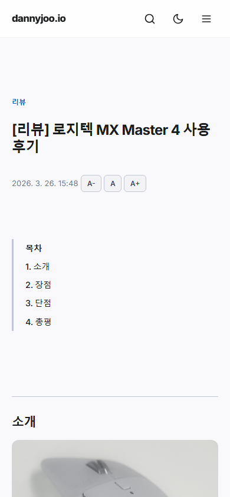</td>
  </tr>
</table>
</details>

### Grain

<table>
  <tr>
    <th align="center" width="50%">라이트</th>
    <th align="center" width="50%">다크</th>
  </tr>
  <tr>
    <td>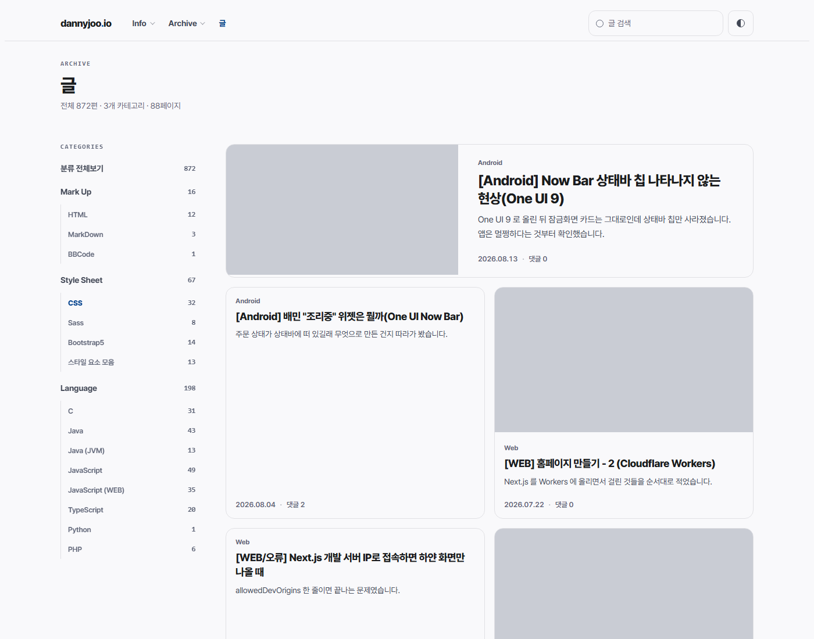</td>
    <td>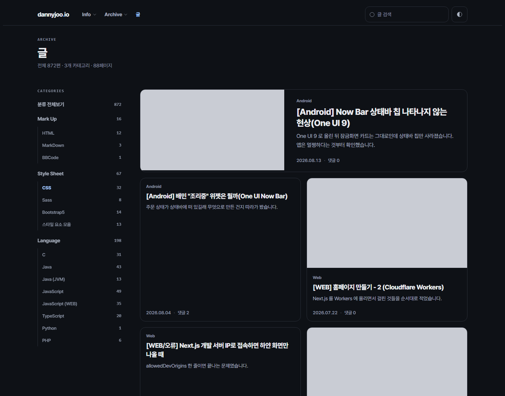</td>
  </tr>
  <tr>
    <td>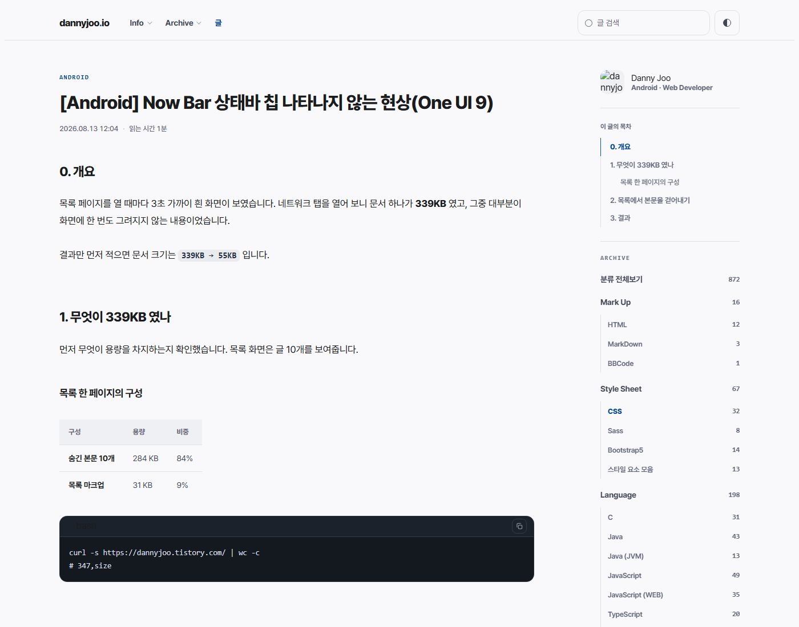</td>
    <td>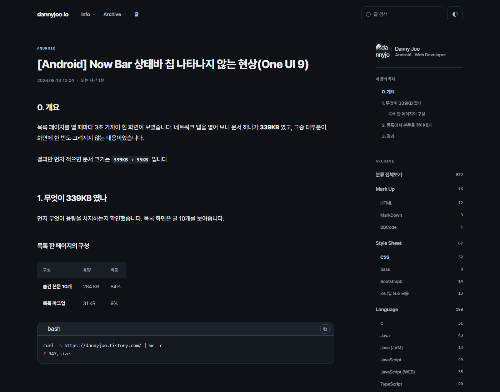</td>
  </tr>
</table>

---

## 적용

```
1. 티스토리 관리자 > 꾸미기 > 스킨 변경 > 스킨 등록
2. 추가 버튼 클릭 후 skin.html, style.css, index.xml 선택
3. 적용 클릭
```

## 커스터마이징

**프로필** — `skin.html`에서 검색 후 수정:

| 찾기 | 변경 |
|:---|:---|
| `dannyjoo.io` | 브랜드명 |
| `dannyjoo` | 표시 이름 |
| 프로필 이미지 URL | 본인 이미지 URL |
| GitHub / YouTube 링크 | 본인 링크 |

**색상** — `style.css` 상단의 CSS Custom Properties 수정

---

## 파일 구조

```
/
├── assets/        # 두 스킨이 같이 쓰는 이미지
├── glass/         # 스킨 1
│   ├── skin.html
│   ├── style.css
│   ├── index.xml
│   └── preview/
└── grain/         # 스킨 2
    ├── skin.html
    ├── style.css
    ├── design.md  # 디자인 브리프 + 데이터 연결
    └── preview/
```

## 기술 스택

`Vanilla JS` · `CSS Custom Properties` · `CSS Grid / Flexbox` · `Inter` · `Pretendard` · `Tistory Template Engine`

---

<div align="center">

MIT License

</div>
