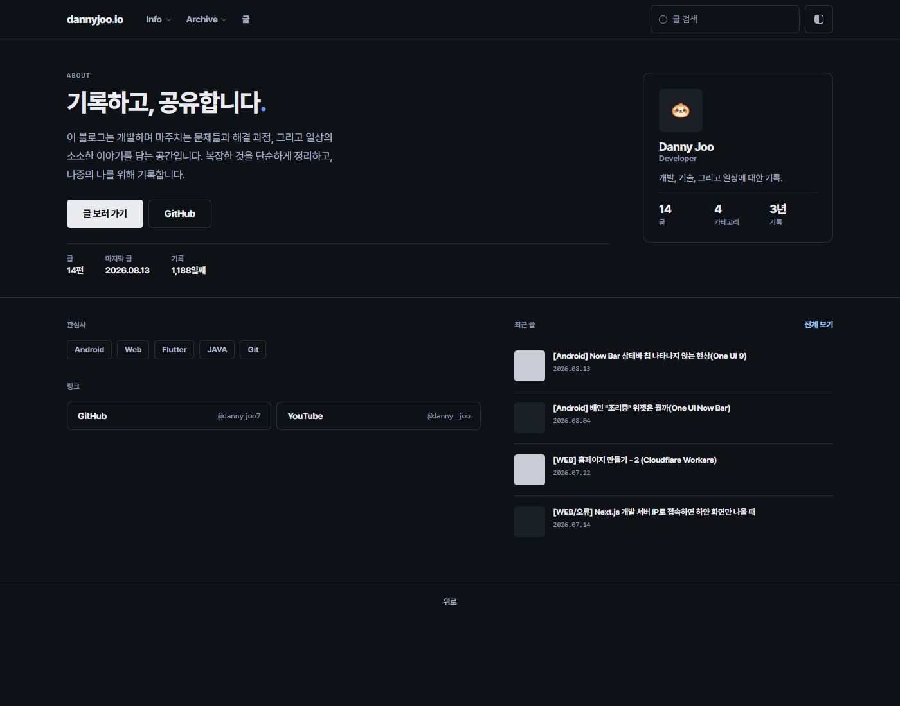

# Grain

얇은 선과 여백 · 디자인 [design.md](design.md) · 전체 [../README.md](../README.md)

## 미리보기

<table>
  <tr>
    <th align="center" width="50%">라이트</th>
    <th align="center" width="50%">다크</th>
  </tr>
  <tr>
    <td></td>
    <td></td>
  </tr>
  <tr>
    <td></td>
    <td></td>
  </tr>
  <tr>
    <td></td>
    <td></td>
  </tr>
</table>

## 커스터마이징

**숫자**
`dist/skin.html` 위쪽 상수 수정

| 찾기 | 변경 |
|:---|:---|
| `START` | 가장 오래된 글 발행일. 운영 일수 기준 |
| `PER_PAGE` | 관리 > 블로그 의 글 목록 개수 |

글 수 · 카테고리 수 · 페이지 수 · 마지막 글 · 운영 일수 자동 적용

**문구**
`dist/skin.html` 에서 검색 후 수정

| 찾기 | 변경 |
|:---|:---|
| `hero__title` | 홈 큰 제목 |
| `hero__lede` | 홈 소개 문장 |
| `tag-list` | 관심사 태그 |
| `link-list` | 외부 링크 |
| `profile.png` | 프로필 이미지 주소 |

**한글 라벨**
작은 라벨은 모노 + 대문자 + 자간이 넓어 한글이 벌어짐.`label-ko` 를 같이 붙임

```html
<p class="widget__title label-ko">이 글의 목차</p>
<p class="widget__title">Categories</p>
```
